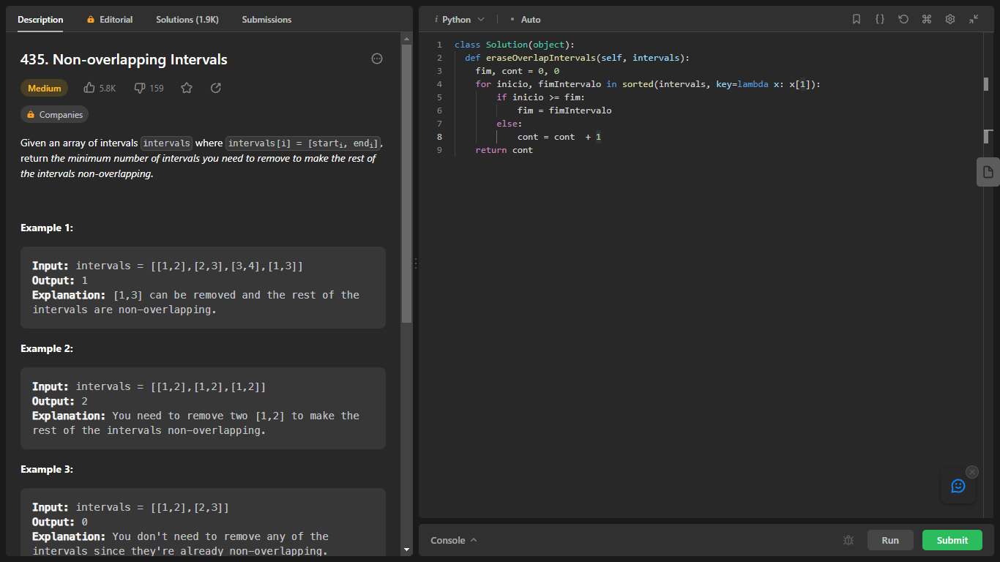
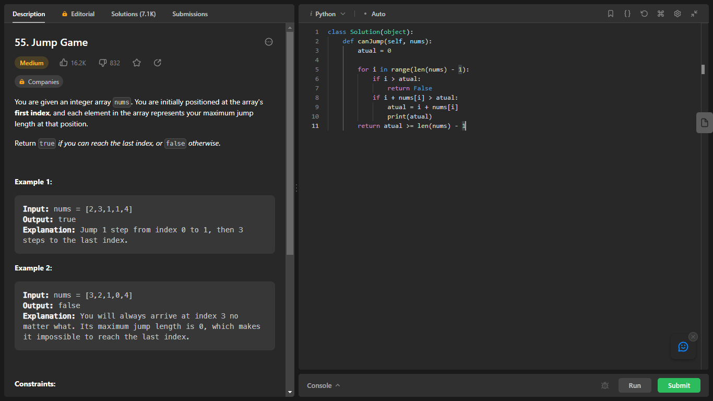

# Greed_Exercicios_Dupla39

**Número da Lista**: 3 
**Conteúdo da Disciplina**: Greed  

## Alunos
|Matrícula | Aluno |
| -- | -- |
| 17/0154319  |  Philipe de Sousa Barros |
| 20/0042416  |  Pablo Christianno Silva Guedes |

## Sobre 
Este trabalho envolve a resolução de exercícios que abordam o conteúdo do módulo de Algoritmos ambiciosos da disciplina de Projeto de Algoritmos. O foco principal é a aplicação de algoritmos em problemas relacionados a toda a classe de problemas de algoritmos ambiciosos.

## Screenshots
### Exercicio 1 - "Non-overlapping Intervals"
**Nível do exercício:** Médio

Para acessar a página do exercício [clique aqui](https://leetcode.com/problems/non-overlapping-intervals/description/)

**Linguagem**: Python 
**Framework**:  
### Vídeo do Exercício 1 [clique aqui]()

### Exercicio 2 - "Jump Game"
**Nível do exercício:** Médio

Para acessar a página do exercício [clique aqui](https://leetcode.com/problems/jump-game/)

**Linguagem**: Python 
**Framework**:  
### Vídeo do Exercício 2 [clique aqui](https://www.youtube.com/watch?v=IawsRW0K7Pw)

### Exercicio 3 - ""
**Nível do exercício:** Médio

Para acessar a página do exercício [clique aqui]()

**Linguagem**: Python 
**Framework**:  
### Vídeo do Exercício 3 [clique aqui]()

## Outros 
Quaisquer outras informações sobre seu projeto podem ser descritas abaixo.
