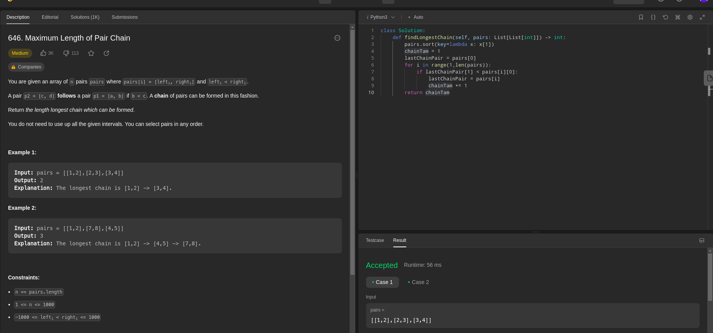
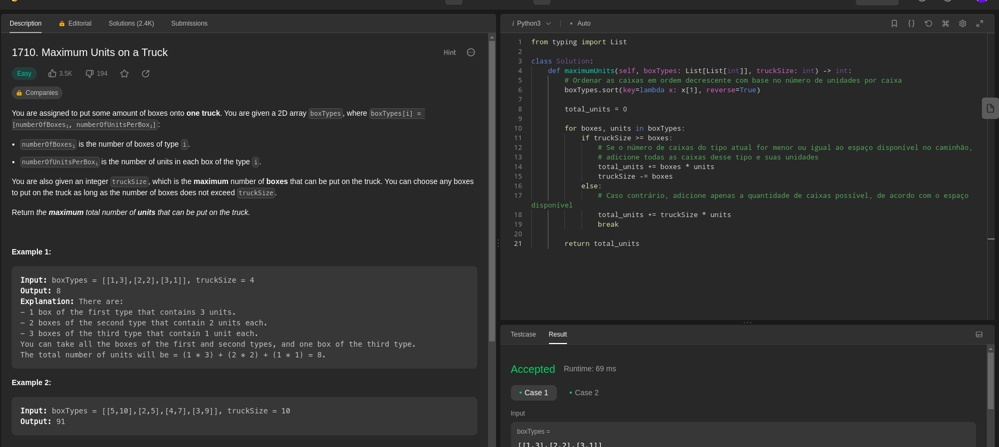

# Greed_Exercicios_Dupla39

**Número da Lista**: 3<br>
**Conteúdo da Disciplina**: Greed <br>

## Alunos
|Matrícula | Aluno |
| -- | -- |
| 17/0154319  |  Philipe de Sousa Barros |
| 20/0042416  |  Pablo Christianno Silva Guedes |

## Sobre 
Este trabalho envolve a resolução de exercícios que abordam o conteúdo do módulo de Algoritmos ambiciosos da disciplina de Projeto de Algoritmos. O foco principal é a aplicação de algoritmos em problemas relacionados a toda a classe de problemas de algoritmos ambiciosos.

## Screenshots
### Exercicio 1 - "Non-overlapping Intervals"
**Nível do exercício:** Médio


Para acessar a página do exercício [clique aqui](https://leetcode.com/problems/non-overlapping-intervals/description/)

**Linguagem**: Python<br>
**Framework**: <br>
## Vídeo do Exercício 1 
O arquivo do vídeo (.mp4) do exercício um se encontra na pasta videos -> [video](https://github.com/projeto-de-algoritmos/Greed_Exercicios_Dupla39/blob/master/videos/exercicio1_Philipe.mp4)

Disponível também no Youtube [clique aqui](https://www.youtube.com/watch?v=MEuKhY-R7Ok)

### Exercicio 2 - "Jump Game"
**Nível do exercício:** Médio


Para acessar a página do exercício [clique aqui](https://leetcode.com/problems/jump-game/)

**Linguagem**: Python<br>
**Framework**: <br>

## Vídeo do Exercício 2
O arquivo do vídeo (.mp4) do exercício dois se encontra na pasta videos -> [video](https://github.com/projeto-de-algoritmos/Greed_Exercicios_Dupla39/blob/master/videos/exercicio2_Philipe.mp4)

Disponível também no Youtube [clique aqui](https://www.youtube.com/watch?v=IawsRW0K7Pw)

### Exercicio 3 - "Maximum Length of Pair Chain"
**Nível do exercício:** Médio



Para acessar a página do exercício [clique aqui](https://leetcode.com/problems/maximum-length-of-pair-chain/description/)

**Linguagem**: Python<br>
**Framework**: <br>

### Exercicio 4 - "Maximum Units on a Truck"
**Nível do exercício:** Fácil



Para acessar a página do exercício [clique aqui](https://leetcode.com/problems/maximum-units-on-a-truck/description/)

**Linguagem**: Python<br>
**Framework**: <br>

<br>

## Instalação 
**Linguagem**: Python<br>

Caso queira testar localmente é necessário instalar python:

- ### Windows
Baixe o pacote Python do [site official](https://www.python.org/downloads/), e no momento da instação, marque a opção "Add Python to PATH".

- ### Linux
Execute no terminal do linux a atualização dos pacotes e instalação do python3

```bash
sudo apt-get update
sudo apt-get install python3
```


## Uso 
Para verificar o funcionamento basta abrir o link do exercicio e copiar o código referente a questão, e logo após realizar o envio. Caso queira verificar localmente, é necessário executar o programa, e para isto basta utilizar o comando:

`python NomeDoArquivo.py`
